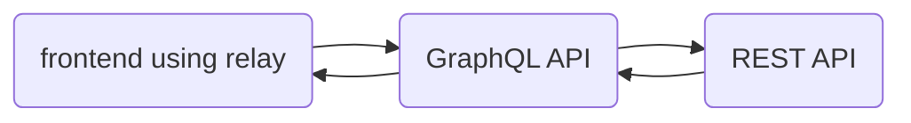

# graphql-node-resource

This library implements the [Node GraphQL type defined by Relay](https://relay.dev/docs/guides/graphql-server-specification/#object-identification). Relay requires that a GraphQL server
has a way to identify and refetch GraphQL resources. Its meant to be used within a GraphQL API that fetches its types from a REST API.



_example architecture_

## Example Application

For a full end-to-end example of this library, see [example/README.md](example/README.md). This demonstrates how to connect this library to a real backend REST API.


## What is a Node?

A `Node` is a refetchable GraphQL resource. All `Node`s must have a _globally unique ID_ and be fetchable via this ID. Relay will refetch these resources in the following way:

```graphql
node(id: $resource_id) {
    ... on Foo {
        bar
        baz
    }
}
```

The spec defines the Node interface in this way:
```graphql
# An object with a Globally Unique ID
interface Node {
  # The ID of the object.
  id: ID!
}
```

It can be used in a GQL schema as such:
```graphql
type User implements Node {
  id: ID!
  # Full name
  name: String!
}
```

See the [Global Identification Page](https://graphql.org/learn/global-object-identification/) for more information.

## The Node Class

The [NodeType](./src/types/NodeType.ts#) class does two things:
1. it defines the `Node` type required by Relay
1. it implements a solution to asynchronously resolve the Node by fetching it from a backing REST API

It is an extension of the [GraphQLObjectType](https://graphql.org/graphql-js/type/#graphqlobjecttype) provided by `graphql-js`.

Every node consists of a backing HTTP REST resource that will be used to fetch the node. This library exposes an [HttpResource class](./src/resources/HttpResource.ts) that implements basic CRUD API operations.

## Usage

### Creating a new Node type

If your API is a standard CRUD API, then all you need to do is create a new instance of a NodeType:

```
import {GraphQLInt} from 'graphql';

// Foo.ts
export default new NodeType({
    // this determines the GraphQL type name
    name: 'Foo',

    // this provides graphql documentation on this type
    description: 'Foo is the catch all example for all things programming',

    // returns an object containing all of the fields for this graphql type
    fields() {
        return {
            bar: {
                type: GraphQLInt,
                description: 'A unit of Foo'
            }
        }
    },

    createResource(ctx) {
        // as long as the `/foo` endpoint follows standard CRUD, then HttpResource should be able
        // to handle fetching it correctly
        return new HttpResource({
            endpoint: "/foo"
        })
    }
});


```


### Adding the Node Field to Your Query Object

In order to fulfill the contract required by Relay, you need to expose a field `node` on your `Query` type.

```
// query.ts
import { getConfig } from '@4c/graphql-node-resource/config';

const config = getConfig();

export default new GraphQLObjectType({
  name: 'Query',

  fields: {
    node: config.nodeField,
    nodes: config.nodesField,
  },
})
```

This will expose `node` and `nodes` on your Query graphql type.

### Resolving a Node Type

There are two ways to resolve a Node type from a parent type:
1. use the `NodeType.getResource(context)` function to get the HTTPResource object and use that to get the node
2. resolve the field to an object containing an id such as `{id: 'foo123'}

### Using Get Resource

You can resolve the resource directly by getting the HTTPResource object from the NodeType instance:
```
// Baz.ts
export default new GraphQLObjectType({
    name: 'Baz',
    fields: {
        foo: {
            type: new GraphQLList(Foo),
            resolve(context) {
                const resource = Foo.getResource(context) as HTTPResource;
                return resource.get(); // get a list of Foos
            }
        }
    }
})
```

This is useful when you don't have an ID and need to resolve a list of resources or
fetch a list of resources and then find the object you are looking for.

### Passing an object with an id

The `NodeType` class provides default resolvers for all defined fields. These resolvers will try to fetch the Node from the provided resource and then resolve to the matching field in the response. In order to do this, the `id` field must be present in the object that is being resolved.

In the example below, the resolver for the `foo` field returns an object with an `id` property. The default resolvers provided by the NodeType will use the `id` property to try and fetch the `Foo` resource.

```
// Baz.ts
export default new GraphQLObjectType({
    name: 'Baz',
    fields: {
        foo: {
            type: Foo,
            resolve: (parent, args, context, info) => {
                return {
                    id: 'foo:123'
                }
            }
        }
    }
})
```

This is useful when you have a list of IDs in the parent type. For instance, if `Baz` has a list of Foo `id`s, then you could pass the list of IDs to the Foo type. See [this example](example/types/Author.ts#L30) for more information.

### Connections

TODO

### Fetching Nodes from a list endpoint

TODO

### Fetching non node types

TODO

### Performance

TODO

## Best Practices

The following is a list of suggested best practices:
1. One HttpResource for one GraphQL type: an HttpResource should be responsible for fetching a single Resource.
